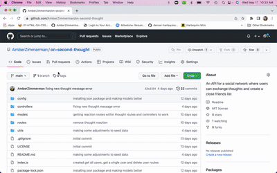
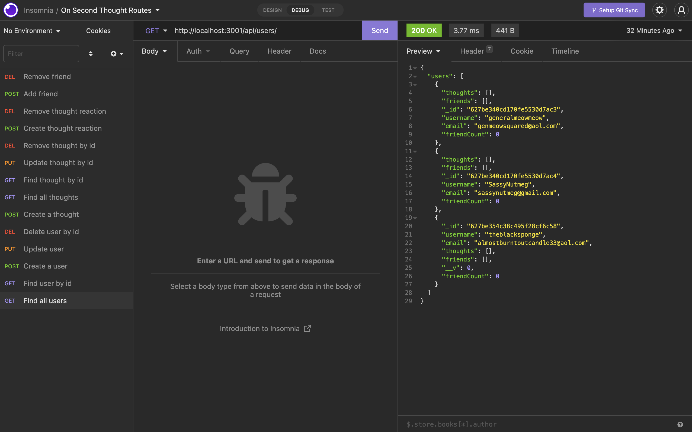

# On Second Thought

### License:

### License Description:

[Click here for the most current description of this license](https://opensource.org/licenses/MIT)

### Link to video walkthough:

Clcik below to watch a four minute instruction video!

[Walkthough Video](https://drive.google.com/file/d/133NcYuzGOFutr-_NW9NsUBHH87dIUvtK/view?usp=sharing)

## Table of Contents:

- [Description](#description)
- [Installation](#installation)
- [Usage Instructions](#usage-instructions)
- [License](#license)
- [Questions](#questions)
- [Screenshots](#screenshot)

### Description of the project:

On Second Thought is an API for a social network web application where friends are able to connect with each other. They can create a friend list as well as write or respond to thoughts. This app uses the express.js and mongoose packages. Insomnia can be used to create data in addition to what is seeded.

### Installation:

In order to install the necessary dependencies, open the console and run the following:

- `npm i`
- `npm run seed`
- `npm start`

### Usage Instructions:

Since this is only the backend API portion, the user will need to use a platform like Postman or Insomnia to test the routes.

### Questions:

If you have any questions contact me on [GitHub](https://github.com/AmberZimmerman)

### Screenshot:

